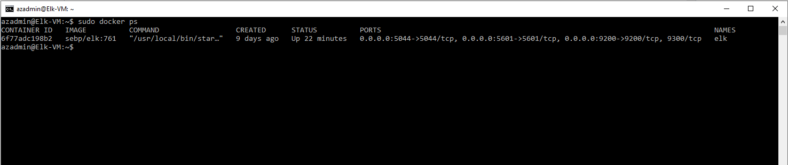

## Automated ELK Stack Deployment

The files in this repository were used to configure the network depicted below.

These files have been tested and used to generate a live ELK deployment on Azure. They can be used to either recreate the entire deployment pictured above. Alternatively, select portions of the YAML file may be used to install only certain pieces of it, such as Filebeat.

  [Ansible Playbook to set up ELK stack on the ELK server](/Ansible/elk-setup.yml)
  
  [ Playbook to set up Filebeat on all web servers](/Ansible/filebeat-playbook.yml)
  
  [Playbook to set up Metricbeat on all web servers](/Ansible/metricbeat-playbook.yml)
  

This document contains the following details:
- Description of the Topology
- Access Policies
- ELK Configuration
  - Beats in Use
  - Machines Being Monitored
- How to Use the Ansible Build

### Description of the Topology

The main purpose of this network is to expose a load-balanced and monitored instance of DVWA, the D*mn Vulnerable Web Application.

- Load balancing ensures that the application will be highly available, in addition to restricting traffic to the network.
The load balancer protects the availability of our servers/applications, and manages all connections to the DVWA servers to ensure that availability. 

- The Topology includes a Jump Box server running an Ansible container. The Ansible container houses the only way to ssh to the other machines in our network. This advantage of this is that it reduces the attack surface, given that it is the only way to SSH into our other machines.

- A seperate server is set up to run an ELK stack. Integrating an ELK server allows users to easily monitor the vulnerable VMs for changes to the files and system metrics.

The configuration details of each machine may be found below.

| Name     | Function | Private IP address | Public IP address | Operating System |
|----------|----------|--------------------|-------------------|------------------|
| Jump Box | Gateway  | 10.1.0.8           | 40.83.48.152      | Linux            |
| Web1     | DVWA     | 10.1.0.5           | 20.106.11.42      | Linux            |
| Web2     | DVWA     | 10.1.0.6           | 20.106.11.42      | Linux            |
| ELK-VM   | Logging  | 10.2.0.4           | 40.70.74.110      | Linux            |

### Access Policies

The machines on the internal network are not exposed to the public Internet. 

Only the Jump Box machine can accept SSH connections from the Internet. Access to this machine is only allowed from the following IP addresses:
-97.118.9.177 (My personal IP)

Machines within the networks can only be SSH'd by the Jump Box. This applies to the ELK Server as well. The SSH policies for the servers can be summarized as:
| Name     | Publicly Accesible | Allowed IPs  |
|----------|--------------------|--------------|
| Jump Box | Yes                | 97.118.9.177 |
| Web1     | No                 | 10.1.0.8     |
| Web2     | No                 | 10.1.0.8     |
| ELK-VM   | No                 | 10.1.0.8     |

For the use of the other services, a summary of the access policies in place can be found in the table below.

| Name   | Port | Allowed IPs  | Purpose |
|--------|------|--------------|---------|
| Web1   | 80   | 97.118.9.177 | DVWA    |
| Web2   | 80   | 97.118.9.177 | DVWA    |
| ELK-VM | 5601 | 97.118.9.177 | Kibana  |

### Elk Configuration

Ansible was used to automate configuration of the ELK machine. No configuration was performed manually, which is advantageous because it makes re-doing the configuration on a new server very simple, and will make the configuration identical on every machine it's applied to.

The playbook implements the following tasks:
- Configures the server to give the ELK container enough memory to run.
- Installs docker.io
- Installs python3-pip and the python docker module so that ansible can run docker commands
- Downloads and launches the elk container with docker. Gives it access to the ports it needs.
- Enables docker to start on boot to ensure the container is running while the server is up.

The following screenshot displays the result of running `docker ps` after successfully configuring the ELK instance.

### Target Machines & Beats
This ELK server is configured to monitor the following machines:
- Web1: 10.1.0.5
- Web2: 10.1.0.6

We have installed the following Beats on these machines:
- Filebeat
- Metricbeat

These Beats allow us to collect the following information from each machine:
- Filebeat collects log files from our Web Machines, granting us a variety of info that system logs can give, for instance, failed ssh attempts.
- Metricbeat collections system metrics, which we could use to view current memory usage, etc.

### Using the Playbook
In order to use the playbook, you will need to have an Ansible control node already configured. Assuming you have such a control node provisioned: 

SSH into the control node and follow the steps below:
- Copy the [ELK setup playbook](/Ansible/elk-setup.yml) into /etc/ansible
- Update the *hosts* file to include an [elk] host collection
- Inlcude by <ELK.VM.Internal.IP> ansible_python_interpreter=/usr/bin/python3 underneath the elk hosts header
- Run the playbook, and navigate to http://<ELK.VM.External.IP>:5601/app/kibana to check that the installation worked as expected.

Likewise, to install filebeat and metricbeat onto the Web servers:
- Copy [their](/Ansible/filebeat-playbook.yml) corresponding [files](/Ansible/metricbeat-playbook.yml) into /etc/ansible
- Update the *hosts* file to include a [webservers] host collection
- Include <Web.VM.Internal.IP> ansible_python_interpreter=/usr/bin/python3 for each Web server we want the beats on
- Run the playbook, and check the corresponding logs or metrics part of kibana to verify that they work.

